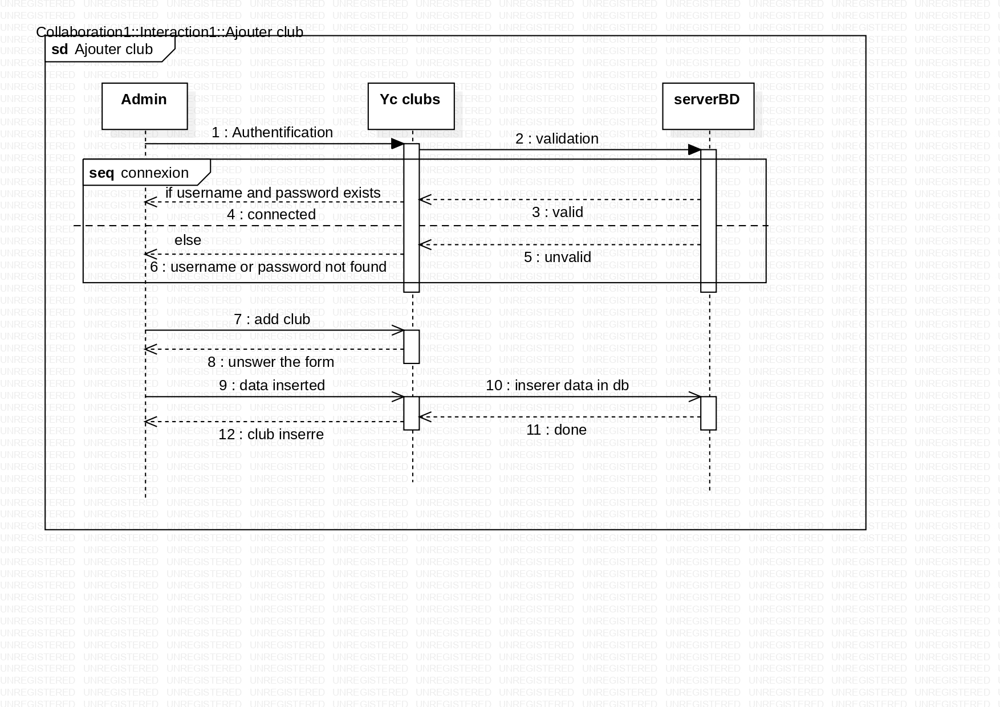
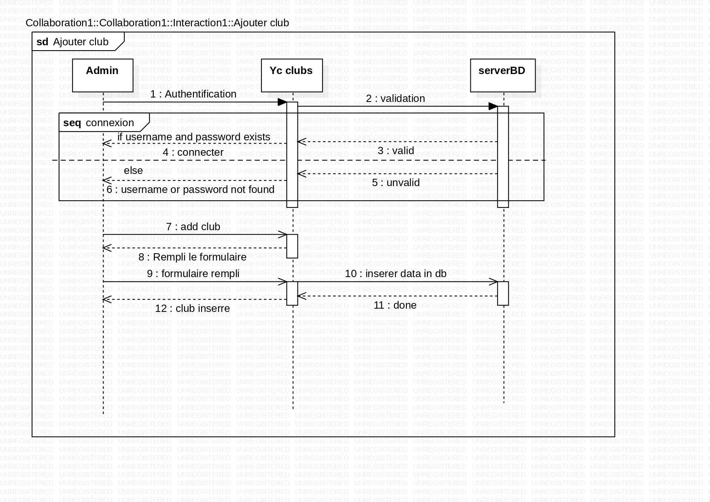
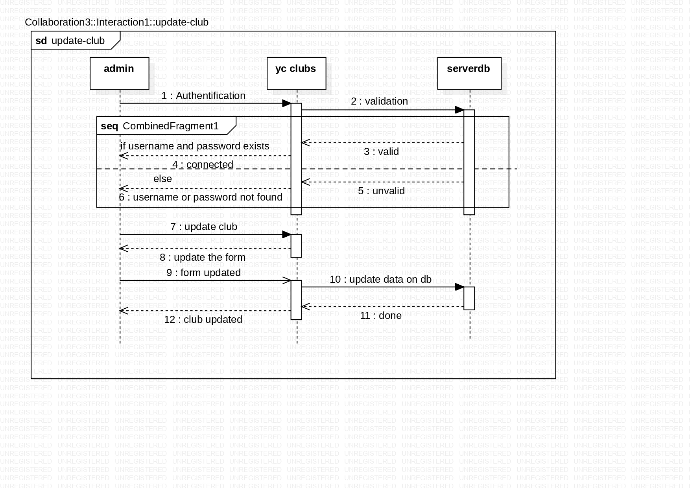
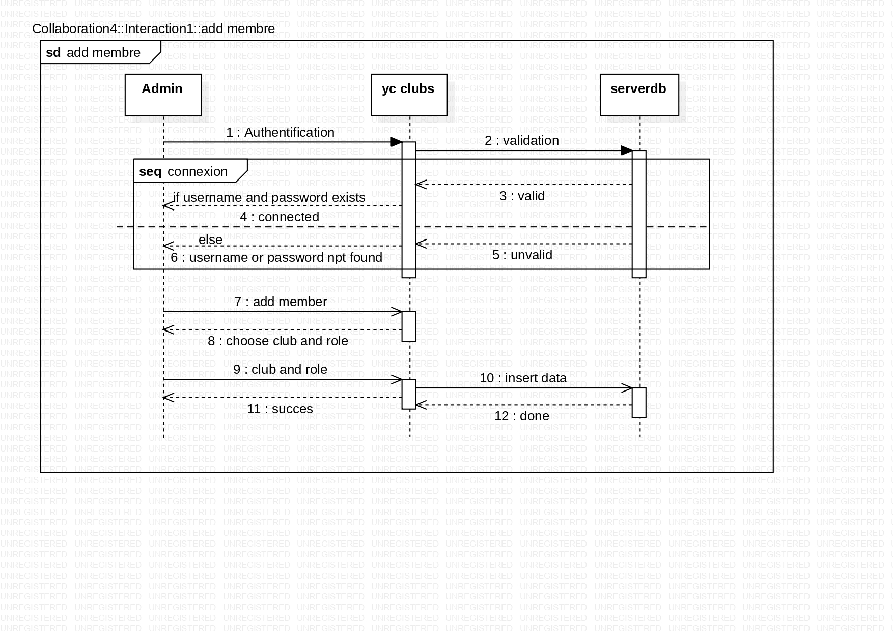
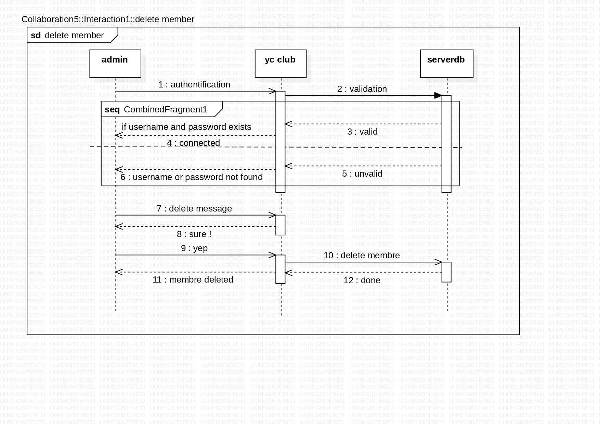

# Gestion des Clubs de Youcode Maroc

## Ecole Youcode  souhaite digitaliser la gestion des Clubs et de ses adhérents

---

### Contexte du projet

école contient plusieurs clubs (Art, robotique, sport,social, Environnement).

Chaque club contient plusieurs adhérents et organise plusieurs évènements.

Le but d'un club est d'organiser des événements et des activités afin d’améliorer la vie estudiantine au sein de Youcode et offrir à ses adhérents un milieu agréable où ils peuvent améliorer leurs soft skills.

Votre école Youcode (Le product owner) vous a sélectionné afin de réaliser une solution web responsive pour gérer les différents clubs de école.

### Description & Contraints ( database)

Un club est défini par son nom, son logo, sa date de création et sa description.

Un apprenant est défini par son nom complet, sa classe, son âge , ...

Un club peut contenir un à plusieurs apprenants(adhérents).

Un apprenant peut adhérer à un seul club .

Un apprenant peut adhérer à un seul club en tant que représentant ou en tant que adhérent. Les apprenants peuvent seulement adhérer à un club, lorsqu’ils y adhèrent, ils obtiennent un rôle.

    

        <h2>diagramme de Cas d'utilisations</h2>
        
    

    

        <h2>diagramme de de Classes.</h2>
        
    

    

        <h2>diagramme de Séquences (Ajouter Club)</h2>
        
    

    

        <h2>diagramme de Séquences (Modifier Club)</h2>
        
    

    

        <h2>diagramme de Séquences (Suprimer Club)</h2>
        
    

    

        <h2>diagramme de Séquences (Ajouter Membre)</h2>
        
    

    

        <h2>diagramme de Séquences (Modifier Membre)</h2>
        
    

    

        <h2>diagramme de Séquences (Suprimer Membre)</h2>
        
    

 

🔗 [Le lien de table Trello](https://trello.com/b/PNrbxSgy/gestion-des-clubs-de-youcode-trello)

