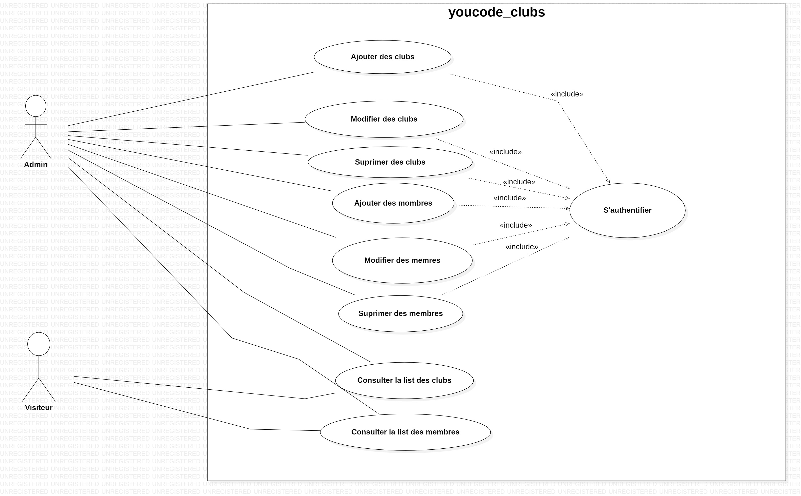
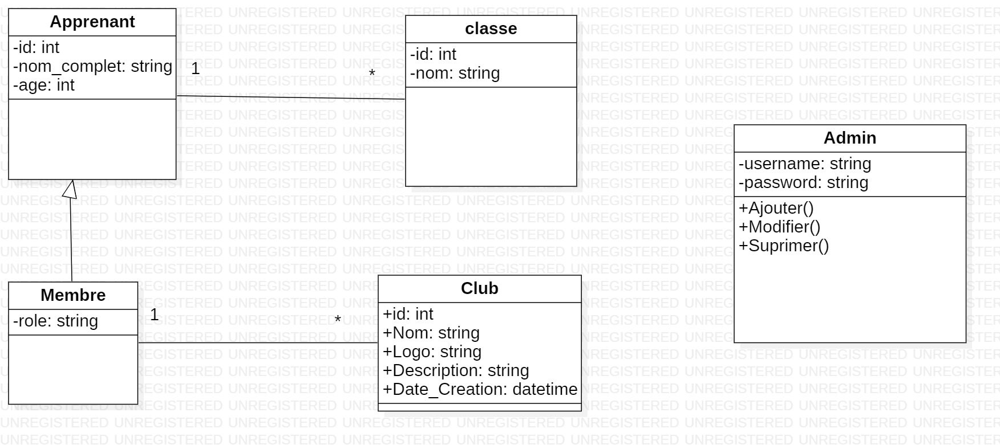
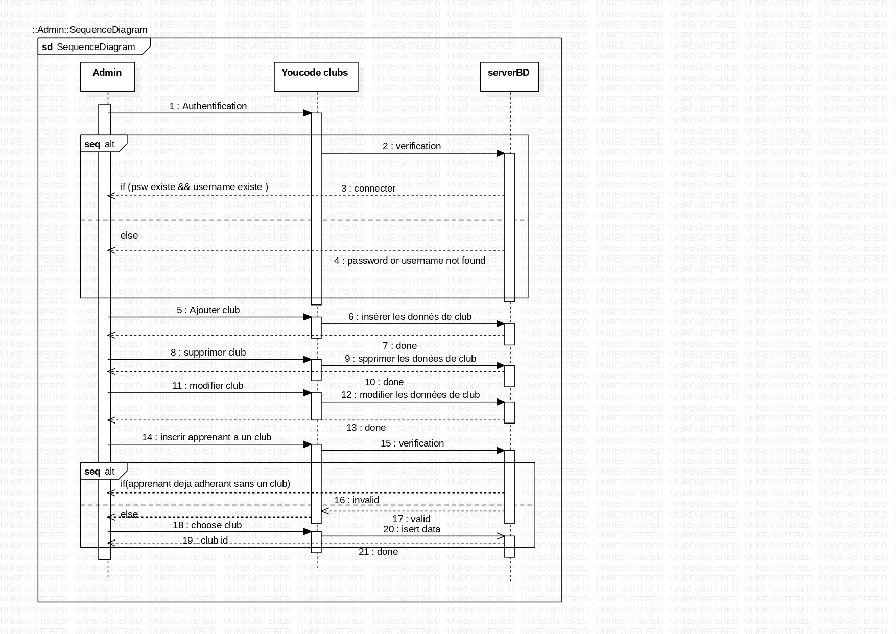

# brief4-youcode-clubs

 

    

        <h2>diagramme de Cas d'utilisations</h2>
        
    

    

        <h2>diagramme de de Classes.</h2>
        
    

    

        <h2>diagramme de Séquences</h2>
        
    

 

🔗 [Le lien de table Trello](https://trello.com/b/PNrbxSgy/gestion-des-clubs-de-youcode-trello)

